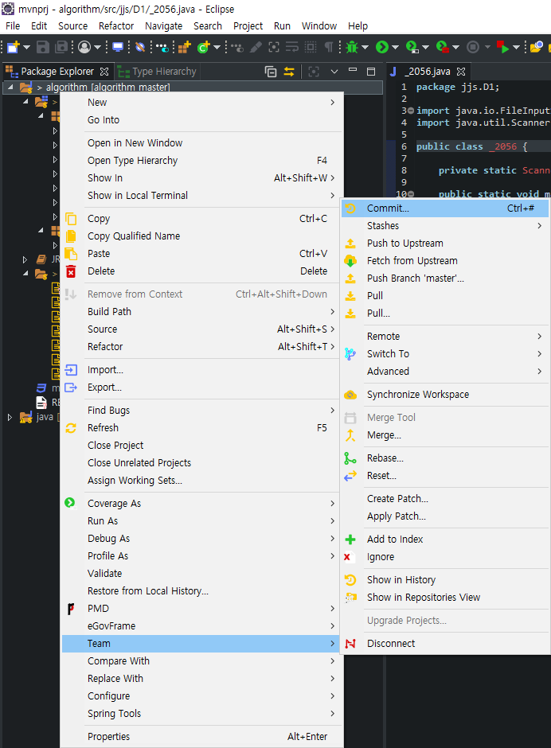
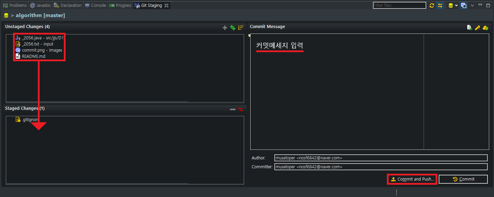
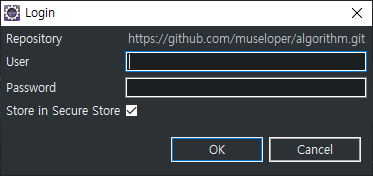

## 참여 방법

### 0. git 설치

> Windows

- [Download 2.30.0 for Windows](http://git-scm.com/download/win)

<br>

> macOS

- `$ brew install git`

<br>

> Linux / Unix

- [http://git-scm.com/download/linux](http://git-scm.com/download/linux)

<br>

### 1. 컨트리뷰터 등록

- 자신의 `github` 계정을 `nosf6842@fusionsoft.co.kr`로 보내주세요.

- 컨트리뷰터 등록 이후 이 저장소에 `push`가 가능합니다. 

<br>

### 2. 프로젝트 클론

> 프로젝트를 **클론**하지 않고 **일반 다운로드**할 경우 원격 저장소를 따로 등록해야하는 번거로움이 생기므로 클론 명령어로 프로젝트를 생성할 것을 권장합니다. 

```bash
# 적당한 디렉토리에서 다음 명령어를 입력합니다. 

$ git clone https://github.com/museloper/algorithm.git
```

<br>

### 3. 프로젝트 이식

- 자신이 사용하는 IDE에 맞게 프로젝트를 임포트 해주세요! : )

<br>

### 4. COMMIT & PUSH

1. `프로젝트 우클릭 > Team > Commit`

    

<br>

2. 작업한 파일 스테이지에 올려서 커밋 & 푸시

    

<br>

3. 아이디 비밀번호 입력

    

<br>